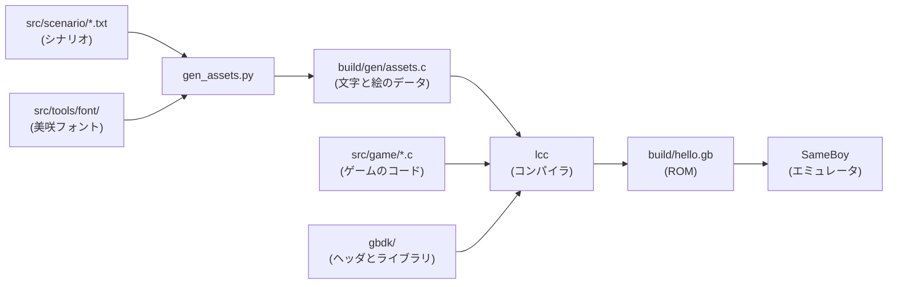

# ゲームボーイソフト開発メモ

GBDK-2020 を使って、ゲームボーイ用のソフトを C 言語で作り、最終的には実機(フラッシュカートリッジ)で動かすための作業用メモ。

## 構成

```
./
├── README.md        このファイル
├── Makefile         ビルドの手順書(`make` で実行)
├── src/
│   ├── scenario/    【人間が書く】シナリオ案
│   ├── game/        【AI が書く】ゲームの C のコード
│   └── tools/       【AI が整備】素材を C に変える仕組み
├── build/           出力。`make clean` で消える
└── gbdk/            GBDK 本体(基本的に触らない)
```

- 人間が編集する場所(`src/scenario/`)と、AI が作業する場所(`src/game/`、`src/tools/`)を分けている。
- `build/` の中身は自動生成なので、手で直さない。
- GBDK 本体は `gbdk/` にまとめて触らないので、更新するときに自分のコードと混ざらない。

## ビルド方法

```
make          # ビルドして、SameBoy で起動する
make build    # ビルドだけ
make run      # 起動だけ
make clean    # build/ を消す
```

## Makefile の説明

`make` は、`Makefile` に書かれた手順どおりにビルドしてくれるツール。
やっていることは、次の3段階。

1. テキストと絵から、C のソースを作る(`gen_assets.py`)。
2. C のソースを GBDK のコンパイラ(`lcc`)に渡して、ROM を作る。
3. ROM をエミュレータ(SameBoy)で起動する。



主な設定は次の3つ。

| 設定 | 意味 |
| --- | --- |
| `GBDK_HOME` | GBDK 本体の場所(既定はルート直下の `gbdk/`) |
| `PROJECT` | 出力する ROM の名前(`hello` → `build/hello.gb`) |
| `EMULATOR` | 起動するエミュレータ(`SameBoy`) |

日本語は、ゲームボーイの標準フォント(英数字のみ)では出せない。
そのため、テキストに出てくる文字だけを美咲フォントから取り出してタイルにし、会話の1画面ごとに VRAM(画面用メモリ)へ入れ替えている。

## ゲームを作る流れ

1. シナリオは `src/scenario/ch1.txt` に書く(1行 = 1画面、`/` で改行、1行16文字まで、2行まで)。
2. ゲームの動きは `src/game/` の C で書く(`#include <gb/gb.h>`)。
3. `make` で ROM を作って、SameBoy で動作確認する。
4. 実機で動かすときは、カートリッジ設定(ROM サイズ、MBC の種類、GBC 対応の有無)を決めて、フラッシュカートに書き込む。

よく使う API(詳細は `gbdk_manual.pdf`):

- 入力: `joypad()`
- スプライト: `set_sprite_data()`、`set_sprite_tile()`、`move_sprite()`
- 背景: `set_bkg_data()`、`set_bkg_tiles()`
- 画面の同期: `vsync()`
- 画像の変換: `png2asset`

## クレジット

- [GBDK-2020](https://github.com/gbdk-2020/gbdk-2020)
- [美咲フォント](https://littlelimit.net/misaki.htm)(門真なむ氏。商用を含め、自由に利用・再配布できる。詳細は `src/tools/font/misaki.txt`)
