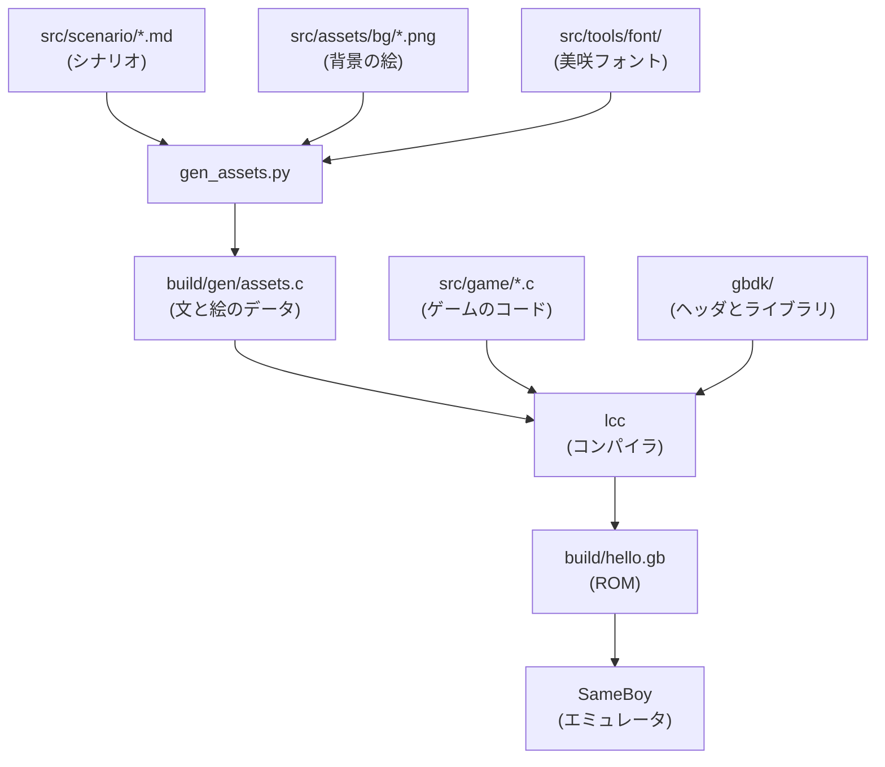

# ゲームボーイソフト開発メモ

GBDK-2020 を使って、ゲームボーイ用のソフトを C 言語で作り、最終的には実機(フラッシュカートリッジ)で動かすための作業用メモ。

## 構成

```
./
├── README.md        このファイル
├── Makefile         ビルドの手順書(`make` で実行)
├── src/
│   ├── scenario/    【人間が書く】シナリオ(ch1.md)
│   ├── assets/      【人間が描く】背景の絵(PNG)。いまは仮素材
│   ├── game/        【AI が書く】ゲームの C のコード
│   └── tools/       【AI が整備】素材を C に変える仕組み
├── build/           出力。`make clean` で消える
└── gbdk/            GBDK 本体(基本的に触らない)
```

- 人間が編集する場所(`src/scenario/`、`src/assets/`)と、AI が作業する場所(`src/game/`、`src/tools/`)を分けている。
- `build/` の中身は自動生成なので、手で直さない。
- GBDK 本体は `gbdk/` にまとめて触らないので、更新するときに自分のコードと混ざらない。

## ビルド方法

```
make          # ビルドして、SameBoy で起動する
make build    # ビルドだけ
make run      # 起動だけ
make clean    # build/ を消す
```

## Makefile の説明

`make` は、`Makefile` に書かれた手順どおりにビルドしてくれるツール。
やっていることは、次の3段階。

1. テキストと絵から、C のソースを作る(`gen_assets.py`)。
2. C のソースを GBDK のコンパイラ(`lcc`)に渡して、ROM を作る。
3. ROM をエミュレータ(SameBoy)で起動する。



主な設定は次の3つ。

| 設定 | 意味 |
| --- | --- |
| `GBDK_HOME` | GBDK 本体の場所(既定はルート直下の `gbdk/`) |
| `PROJECT` | 出力する ROM の名前(`hello` → `build/hello.gb`) |
| `EMULATOR` | 起動するエミュレータ(`SameBoy`) |

日本語は、ゲームボーイの標準フォント(英数字のみ)では出せない。
そのため、テキストに出てくる文字だけを美咲フォントから取り出してタイルにし、会話の1画面ごとに VRAM(画面用メモリ)へ入れ替えている。

## ゲームを作る流れ

1. シナリオは `src/scenario/ch1.md` に書く(書式は次の「シナリオの書式」)。背景の絵は `src/assets/bg/` に PNG で置く。
2. ゲームの動き(エンジン)は `src/game/` の C にある。
3. `make` で ROM を作って、SameBoy で動作確認する。
4. 実機で動かすときは、カートリッジ設定(ROM サイズ、MBC の種類、GBC 対応の有無)を決めて、フラッシュカートに書き込む。

よく使う API(詳細は `gbdk_manual.pdf`):

- 入力: `joypad()`
- スプライト: `set_sprite_data()`、`set_sprite_tile()`、`move_sprite()`
- 背景: `set_bkg_data()`、`set_bkg_tiles()`
- 画面の同期: `vsync()`
- 画像の変換: `png2asset`

## シナリオの書式

シナリオは `src/scenario/chNN.md`。ゲームの文は、ここからしか作らない。
書き間違えると、`make` のときに、何行目が何の問題かを日本語で教えてくれる。

```
# 第1章 掘る

## room 部屋
bg: room_night
> 夜。
> 誰ともつながらない部屋で/ビートだけを作っている。
?
- 外に出る -> street

## street 夜の街
bg: street_night
> 夜の街。/どこへ行こう。
?
- 中古屋へ行く -> shop_front
- 部屋に戻る -> room [if found_record]

## street_board
> 色あせたチラシ。/「公園で、音を鳴らそう」
-> street
```

- `## id 見出し`:場面。id は英数字(行き先の指定に使う)。最初の場面から始まる
- `bg:`:背景の絵(`src/assets/bg/名前.png`)。書かなければ、前の場面の絵のまま
- `>`:1ページ。`/` で改行。1行12文字まで、2行まで
- `店主：` で始まるページは、名前を上の帯に出す(文字数に数えない)
- `?` のあとの `- 文 -> id`:選択肢(最大4つ、1つ11文字まで)。`[if フラグ]` `[unless フラグ]` で条件をつけられる
- `-> id`:次の場面へ進む
- `set: フラグ`:フラグを立てる
- `sleep:`:章の終わり(暗転して、章のタイトルを出す)
- `//` で始まる行:コメント
- 場面の最後は、`?`(選択肢)か `-> id` か `sleep:` のどれかにする
- まだ使えない:`random:`、`se:`、`call:`

## 今の状態と TODO

作るのは、選択肢で進むテキストアドベンチャー。歩く操作はない。

- 画面の上に場所の絵(160x112)、下に文の枠(160x32)。A で文を送り、文が終わると選択肢が出る。
- 文字は 8x8 の標準フォント(美咲フォント)。1行12文字、1ページ2行まで。
- 絵は奥行きのある一枚絵にする(手前が大きく暗く、奥が小さく明るい、一点透視)。4色で描く。
- シナリオと絵は John が持つ。エンジン、変換ツール、仮素材は AI が作る。AI は、John が書いた文と描いた絵を勝手に書き換えない。

歩く方式で作った最初のバージョン(第1章の場面1〜4)は、Git の履歴(コミット `298f524`)に残っている。

作業の順番:

- [x] 1. シナリオ変換と、文と選択肢が動くエンジン(動作確認待ち)
- [x] 2. 背景の表示(動作確認待ち)
- [ ] 3. 仮背景(一点透視)を全場所ぶん(いまあるのは room_night だけ。ほかは仮の灰色)
- [ ] 4. 第1章をシナリオ書式に移して、最後まで遊べる状態にする
- [ ] 5. セーブ、章タイトル、フェード、効果音
- [ ] 6. ミニゲーム(ディグから)
- [ ] 実機向けのカートリッジ設定(ROM サイズ、MBC)
- [ ] フラッシュカートで実機確認する

## クレジット

- [GBDK-2020](https://github.com/gbdk-2020/gbdk-2020)
- [美咲フォント](https://littlelimit.net/misaki.htm)(門真なむ氏。商用を含め、自由に利用・再配布できる。詳細は `src/tools/font/misaki.txt`)
